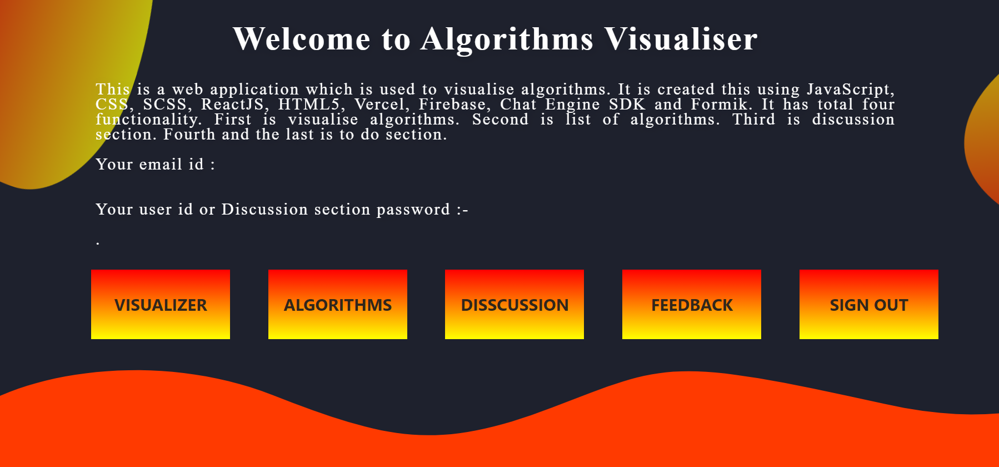
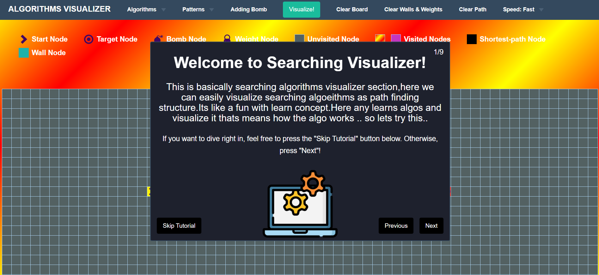
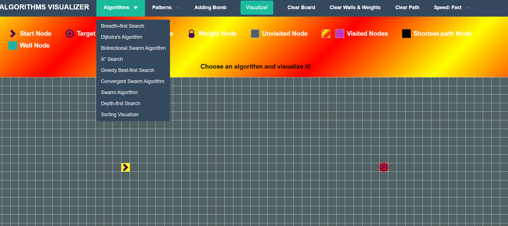
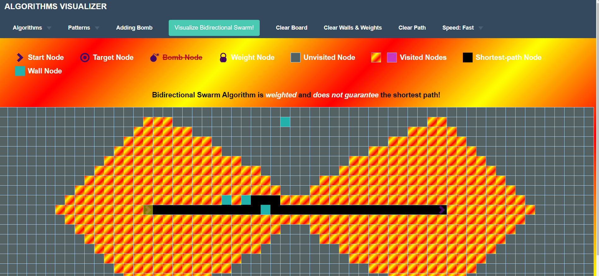

# SEARCHING-ALGORITHMS-VISUALIZER-PART :star_struck: :open_file_folder: :computer:

[](https://shields.io/) [](https://shields.io/) [](https://shields.io/)


## About :point_down: 

<div align="justified">
        
*It is a part of functionality 1 of my project.* Algorithm Visualizer is an online platform that visualizes algorithms from as per user choice. Algorithm-visualizer is a web app written in React. It contains UI components and interprets commands into visualizations. Here are two types of algorithms, searching and sorting. Here user will get a tutorial for using this web application. Here we can set the size, speed, name of algorithm them it will show how the algorithm actually works. 
</div>

## FEATURES IN SEARCHING VISUALIZER :point_down:

1. Algorithms<br>
 - Breadth-First Search<br>
 - Dijkstra's Algorithm<br>
 - Bidirectional Swam Algorithm<br>
 - Convergent Swam Algorithm<br>
 - Swam Algorithm<br>
 - Depth-First Search<br>
2. Patterns<br>
 - Simple Stair Pattern<br>
 - Basic Weight Maze<br>
 - Recursive Division<br>
 - Recursive Division(Vertical Skew)<br>
 - Recursive Division(Horizental Skew)<br>
3. Adding Bomb<br>
4. Visualize<br>
5. Clear Board<br>
6. Clear Walls & Weights<br>
7. Clear Path
8. Speed
 - Fast
 - Average
 - Slow

## LINK of full project: :point_right: https://algo-visualize-login-signup.vercel.app/login

## Purpose :point_down:

<div align="justified">
        
Algorithms are used in every part of computer science. They form the field's backbone. In computer science, an algorithm gives the computer a specific set of instructions, which allows the computer to do everything, be it running a calculator or running a rocket. Algorithmic thinking, or the ability to define clear steps to solve a problem, is crucial in many different fields. Even if we’re not conscious of it, we use algorithms and algorithmic thinking all the time. Algorithmic thinking allows students to break down problems and conceptualize solutions in terms of discrete steps. Being able to understand and implement an algorithm requires students to practice structured thinking and reasoning abilities. I have made this website to easily study algorithms. I have made this to make learning algorithms an interesting, facinating and easy work.
</div>

## Use :point_down:

<div align="justified">
        
Clicking on Visualize Algorithms user can see searching visualizer and there in the drop down menu user has to choose sorting algorithms to watch and understand working of some specific algorithms. User can read the tutorial which describes how to use that web application. User can change the values to see different working way. User just has to follow the tutorials to use this.
</div>

## Importance :point_down:

<div align="justified">
        
There are two principal applications of algorithm visualization: research and education. Potential benefits for researchers are based on expectations that algo-rithm visualization may help uncover some unknown features of algorithms. For example, one researcher used a visualization of the recursive Tower of Hanoi algo-rithm in which odd- and even-numbered disks were colored in two different colors. He noticed that two disks of the same color never came in direct contact during the algorithm’s execution. This observation helped him in developing a better non-recursive version of the classic algorithm. The application of algorithm visualization to education seeks to help students learning algorithms. The available evidence of its effectiveness is decisively mixed. Although some experiments did register positive learning outcomes, others failed to do so. The increasing body of evidence indicates that creating sophisticated software systems is not going to be enough. In fact, it appears that the level of student involvement with visualization might be more important than specific features of visualization software. In some experiments, low-tech visualizations prepared by students were more effective than passive exposure to sophisticated software systems. <br>
Searching Algorithms are designed to check for an element or retrieve an element from any data structure where it is stored. Based on the type of search operation, these algorithms are generally classified into two categories:<br>
Sequential Search: In this, the list or array is traversed sequentially and every element is checked. For example: Linear Search.<br>
Interval Search: These algorithms are specifically designed for searching in sorted data-structures. These type of searching algorithms are much more efficient than Linear Search as they repeatedly target the center of the search structure and divide the search space in half. For Example: Binary Search. <br> Learning sorting algorithms get much easier with visualizing it. So it is a great way to study and understand algotihms.
</div>

## Folder Structure :point_down:

```bash
Searching-Visualizer
        ├── public
        |      ├── browser
        |      |      ├── animations
        |      |      ├── mazeAlgorithms
        |      |      ├── pathfindingAlgorithms
        |      |      ├── board.js
        |      |      ├── bundle.js
        |      |      ├── getDistance.js
        |      |      └── node.js
        |      └── styling
        |             ├── fonts
        |             ├── cssBasic.css
        |             ├── cssPokemon.css
        |             └── svgs and imgs
        ├── server.js
        └── index.html
```                

## Making :point_down:

<div align="justified">
        
It has been created using advance JavaScript, advance CSS3, SCSS, ReactJS, advance HTML5, nodejs. It is fully responsive.<br>
For references for algorithms I have used [geeksforgeeks](https://www.geeksforgeeks.org/searching-algorithms/) and [wikipedia](https://en.wikipedia.org/wiki/Search_algorithm).
</div>

## Screenshots :point_down:

<div align="center">
<a href="login.PNG"></a> <a href="main.PNG"></a>
        
<a href="s1.PNG"></a> <a href="s2.PNG"></a>

<a href="s3.PNG"></a> <a href="load.PNG"></a>

</div>
